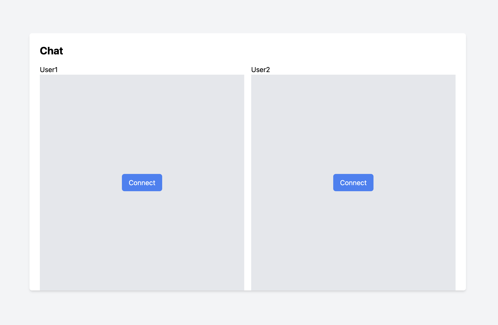
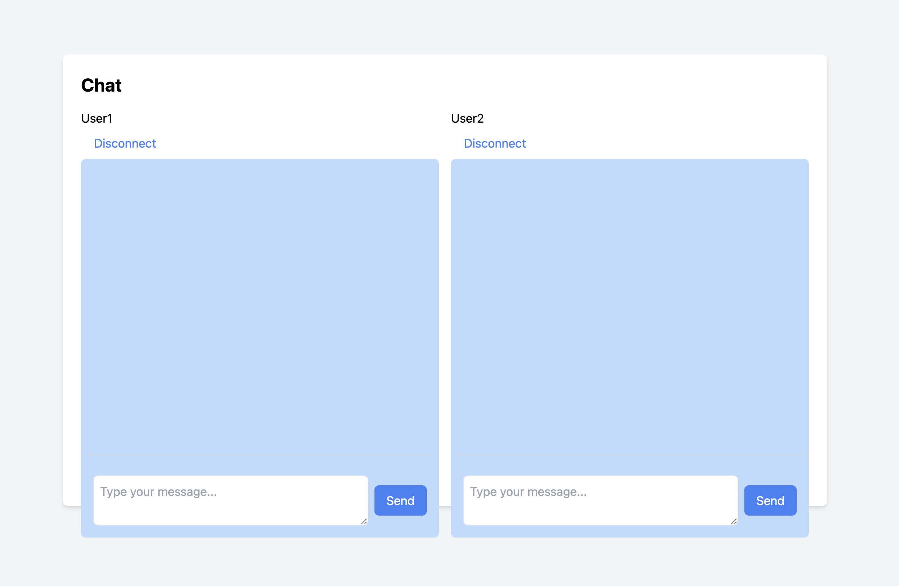
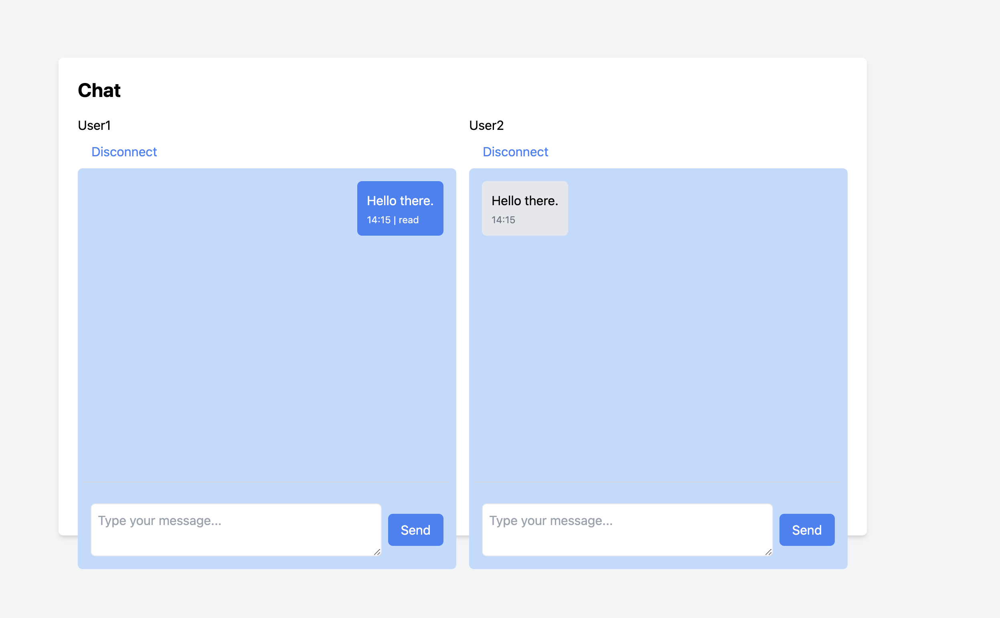

# DRF-WS-CHAT

DRF-WS-CHAT is a simple chat application built on Django Restframework, ReactJS powered by Websockets. This app allow's two users
User1 and User2 to chat with each other in real time.

### Features
1. [Authentication](#authentication) via UUID
2. JWT Authorization
3. Delivery Receipts
4. Read Receipts

## Pre-requisites
1. Docker
2. Docker Compose
3. Unix Terminal or Windows Command Line (This guideline assumes you are using Unix Terminal)

## Environment Setup
1. Clone this repository git clone https://github.com/Shaibujnr/drf_ws_chat.git
2. Run `cd drf_ws_chat/frontend` to enter the frontend directory
3. Run `cp .example.env .env` to make a copy of the .example.env file
4. Run `cd ..` to go back into the root of the project
5. Run `make build` or `docker compose build` or `docker-compose build` whichever one works
5. Run `make migrate` or copy and run the commnd under `migrate` in the makefile to run database migrations
5. Run `make serve` or `docker compose up` or `docker-compose up` (whichever one works for you)
6. Open your browser and visit `http://localhost:3000` 

## Usage
You should be presented with a screen that looks like this:

On the left hand side is the chat screen for User1 and on the right hand side is that of User2. Clicking on connect will potentially [authenticate](#authentication) the user and present the chat screen with a disconnect button, an input box and send button like this:

Think of the disconnect button as a way to logout basically.

You can enter a message into the input box, click on the send button to send the message to the other user. Messages you send will 
appear on the right side of the display in a blue bubble and the receiver will receive them on the left side of their display in a 
gray bubble. like this:

And now you can send messages back an forth between both users.

## Implementation

### Authentication
The authentication process is very simple. We define an `AuthApiView` [here](backend/chat/views.py). This view defines a post method that accepst json data and checks for `uuid` in the request data. It then compares the uuid in the request with the uuids stored in the [ChatManager](backend/chat/chatmanager.py), if the `uuid` exists, it creates a `jwt` token from the uuid and returns it as a response. This token can
be used to authorize the user for future requests to protected endpoints.

## Authorization

The other views in [views.py](backend/chat/views.py) use the `authenticate_request` function to get the authenticated user uuid. The function decodes the jwt token, extracts the uuid in the token, compares it to the `uuids` in the [ChatManager](backend/chat/chatmanager.py) just like in the [Authenticaton](#authentication). If the uuid exists, we return the uuid to indicate successful authorization.

--

When `uvicorn` starts our server, it gets an instance of the asgi application from [asgi.py](backend/backend/asgi.py). In asgi.py we instantiate the [ChatManager](backend/chat/chatmanager.py) and we use that in our custom [ChatManagerMiddleware](backend/chat/middleware.py). This middleware will inject the `chat_manager` instance and the `asyncio event loop` in the request scope so that they can be accessed from all routes. In the asgi.py we also create a [dispatcher](backend/chat/dispatcher.py) task to loop forever and deliver undelivered messages to it's intended recipients. This is to ensure that receivers receive the messages meant for them.

When the user connects/authenticates on the browser, the frontend first fetches all previous messages between both users and when a user sends a message from the web browser we make a post request from [handleSendMessage](frontend/src/components/Chat.js) to [MessagesAPIView](backend/chat/views.py) and when we successfully store the message in the db we instantly send the message to the receiver using the chat_manager. (If the message fails to deliver for any reason, perhaps the user disconnected or something, the dispatcher task will resend it).

When the receiver receives the message on the websocket socket connection, it compares the message's `uuid` with the `uuids` of all the messages it has processed and displayed, if the `uuid` doesn't exist it displays it. Then it makes a post request to [MessageReceviedAPIView](backend/chat/views.py) to acknowledge receiving the message. The [MessageReceviedAPIView](backend/chat/views.py) endpoint will update the delivery status of the message and notify the sender so that the sender will update the message bubble to `delivered`. Updating the delivery status will also prevent the task from dispatching the message to the receiver.

When a message is visible on the receivers screen, it makes a  post request to [MessageSeenAPIView](backend/chat/views.py). This endpoint will update the read status of the message and also notify the sender using the chat manager.
